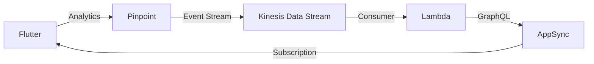

# Amplify Integration Backend

This CDK project spins up a backend for integration testing the Amplify Flutter packages.

> Ensure you have `pnpm` installed by running `npm install -g pnpm` or following the instructions [here](https://pnpm.io/installation).

To deploy the stack, run `pnpm run deploy`.

> **Note**: Run `pnpm run setup` if this is the first deploying a CDK project to your account in order to provision the resources needed for CDK to work. See [Bootstrapping](https://docs.aws.amazon.com/cdk/v2/guide/getting_started.html#getting_started_bootstrap) for more information.

To tear down the stack, run `pnpm run destroy`.

## Categories

Category-specific architectures are described below.

### Analytics

Part of the problem testing the Analytics category is that the Analytics API consists entirely of "fire-and-forget" methods. Even `flushEvents` does not throw an error when it fails - all events are meant to be async.

In order to test that the Analytics category is working as expected, we employ a method similar to what's done in the Auth category for capturing SMS messages. Namely, we route all Pinpoint events to an AppSync subscription we can listen on. This is done with the help of a Kinesis stream (to which Pinpoint can natively export) and a Lambda function (which can be triggered by a Kinesis stream).

