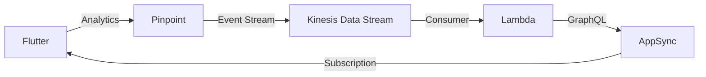

# Amplify Analytics Integration Backend

This CDK project spins up a backend for integration testing Pinpoint Analytics in Amplify Flutter.

To deploy, run `npm run deploy`.

```mermaid
flowchart LR
    F[Flutter] -->|Analytics| P[Pinpoint];
    P -->|Event Stream| K[Kinesis Data Stream];
    K -->|Consumer| L[Lambda];
    L -->|GraphQL| A[AppSync];
    A -->|Subscription| F;
```
