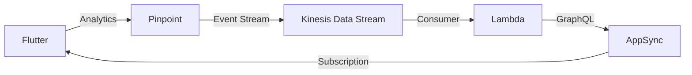

# Amplify Analytics Integration Backend

This CDK project spins up a backend for integration testing Pinpoint Analytics in Amplify Flutter.

To deploy, run `npm run deploy`.

> **Note**: Run `npm run setup` if this is the first deploying a CDK project to your account in order to provision the resources needed for CDK to work. See [Bootstrapping](https://docs.aws.amazon.com/cdk/v2/guide/getting_started.html#getting_started_bootstrap) for more information.

